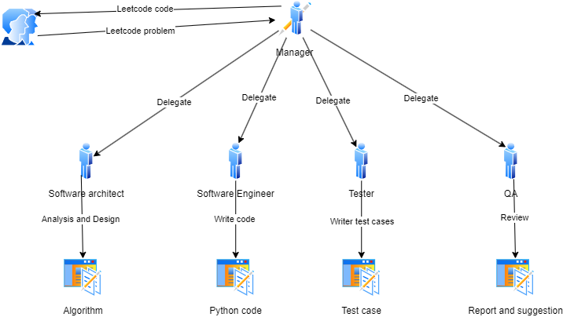

# LeetCodeSolver Crew

Welcome to the **LeetCodeSolver** project, powered by [crewAI](https://crewai.com)! 🚀  
This innovative agent-based system is designed to help you solve LeetCode problems effortlessly, from easy to hard. A team of AI agents collaborates to analyze problems, design algorithms, write and test code, and optimize performance.  

### How the Crew Works



The LeetCodeSolver Crew operates in a hierarchical structure to efficiently solve LeetCode problems. Here's a breakdown of the workflow:

1. **Manager**: The manager receives the LeetCode problem and delegates tasks to the appropriate team members.
2. **Software Architect**: Analyzes the problem and designs the algorithm.
3. **Software Engineer**: Writes the Python code based on the algorithm.
4. **Tester**: Writes test cases to ensure the code works correctly.
5. **QA**: Reviews the code and test cases, providing reports and suggestions for improvements.

Each team member focuses on their specialized role, ensuring a streamlined and efficient problem-solving process.

---

## 🚀 Getting Started

### Prerequisites

Ensure you have **Python >=3.10 <3.13** installed. This project uses [UV](https://docs.astral.sh/uv/) for seamless dependency management.

### Installation Steps

1. **Install Docker**
- Docker is necessary to execute Python code using the CodeInterpreterTool.

2. **Install UV**    
    If you haven't already, install UV by running:  
    ```bash
    pip install uv
    ```

3. **Set Up the Project**  
    Navigate to your project directory and install dependencies:  
    ```bash
    uv install
    ```

    *(Optional)* Lock dependencies and install them using:  
    ```bash
    crewai install
    ```

---

## ⚙️ Configuration

1. **Environment Setup**  
    - Copy `.env-template` to `.env`.  
    - Configure the `LLM_PROVIDER` and `MODEL` variables by commenting/uncommenting the options.  
    - Add your API key for the chosen LLM provider (e.g., `OPENAI_API_KEY` for OpenAI).

2. **Prepare LeetCode Problem Files**  
    - Visit [LeetCode](https://leetcode.com/) and copy the problem description into a markdown file.  
    - Save the markdown file in the `data` folder.  
    - Update the `.env` file with the path to your problem file:  
      ```env
      LEETCODE_FILE="data/your_leetcode_file.md"
      ```

---

## 🔍 Monitoring Progress with Phoenix

1. Open a new terminal window and start Phoenix:  
    ```bash
    phoenix serve
    ```

2. Access the Phoenix dashboard at: [http://localhost:6006](http://localhost:6006)

---

## 🏃 Running the Project

To start solving problems with your AI crew, run the following command from the project root:  
```bash
crewai run
```

- This will initialize the LeetCodeSolver Crew, assign tasks, and begin execution based on your configuration.
- The final code will be stored in result folder with the same name as leetcode file.

---


## 🤖 Meet Your Crew

The **LeetCodeSolver Crew** consists of multiple specialized AI agents, each with unique roles and tools. These agents work together to tackle tasks defined in:  
- `config/tasks.yaml`: Task definitions and workflows.  
- `config/agents.yaml`: Agent capabilities and configurations.

---

Unleash the power of AI collaboration and solve LeetCode problems like never before! 🎉
